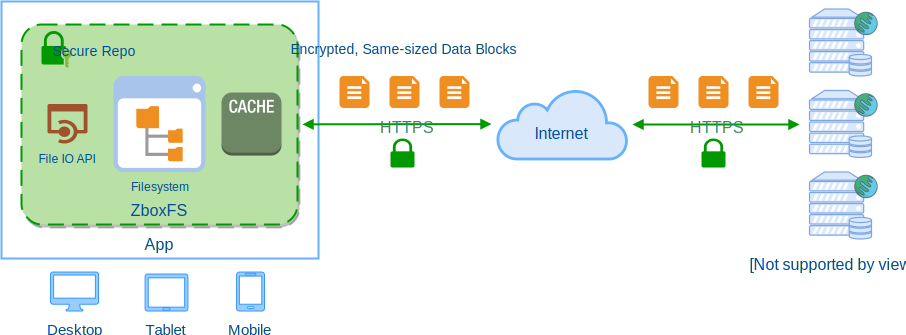

# Introduction

Zbox is a no-knowledge, privacy-focused cloud flie storage for apps. It is based
on the zero-details, private in-app file system [ZboxFS](https://zbox.io/fs).

Its goal is to help applications to store files securely, privately and reliably.

Unlike other cloud storages, Zbox takes privacy as the top priority. By using
state-of-the-art cryptos, everything stored in Zbox is encrypted locally,
including file contents, metadata, directories and etc. Unencrypted data never
leaves your local device memory.

Apart from advanced encryption, Zbox also unifies data to same-sized blocks to
eliminate metadata leakage. Nobody except you knows what the file contents are
and how many files are stored. Zbox also knows nothing about your files, except
the total bytes used.

Zbox is also a transactional file storage. Any modification on your files and
directories are guarded by ACID transaction. Data integrity is guaranteed by
authenticated encryption primitives [AEAD encryption](https://en.wikipedia.org/wiki/Authenticated_encryption).

## How It Works

As a module, Zbox runs within the same memory as your application. It
encapsulates a virtual filesystem in a secure repository and provides file IO
API to application.

## Features

## FAQ
