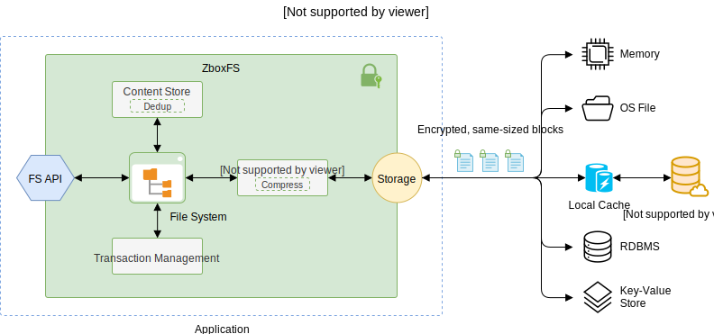

# Introduction

Zbox is a zero-details, privacy-focused cloud storage for applications. Its goal
is to help applications store files securely, privately and reliably. By
embedding an encrypted virtual file system [ZboxFS], it provides a secure and
private repository for applications.

Unlike other cloud storages, Zbox takes privacy as top priority. Everything
stored in Zbox, including file contents, directories and metadata, is encrypted
on the client side by state-of-the-art cryptography.

Unencrypted data never leaves application's local memory. In case device is
compromised or storage is stolen, Zbox will still keep your application's data
protected, as long as application memory is not exposed.

Additionally, Zbox packs file contents, file sizes, metadata and directories
into same-sized blocks and encrypts individually. No other parties, except your
application, can obtain details about your data. Zbox cloud storage itself has
no exception, it knows nothing about your data except the total bytes used.

Zbox is also a transactional file storage. That is, any modification on files or
directories are guarded by [ACID] transaction. Data integrity is guaranteed by
authenticated encryption primitives, see [AEAD encryption].

## How It Works

Zbox runs an virtual file system [ZboxFS] in the same memory space as your
application. It encapsulates data in a secure repository
[Repo](/api/javascript.html#class-repo) and provides file system API to
application.

All data stored in the repo is encrypted using user-specified key Optionally,
data can be de-duplicated and compressed. When saving a file to the repo, its
content and metadata is packed into same-sized blocks and encrypted individually.

By abstracting IO access, ZboxFS supports a variety of underlying storages,
including memory, OS file, RDBMS and key-value object store.

Zbox Cloud Storage is a cloud file storage designed specifically to work with
ZboxFS. Like the other storages, it is has no knowledge about your data. Backed
by geo-distributed CDN, it can store data in the region close to your
application.

A local cache, which is also has no knowledge about application's data, is used
to boost IO performance. It can use different storages too, such as memory,
[IndexedDB] or local files.

## Features

- Everything is encrypted locally :lock:, including metadata and directory
  structure, no knowledge can be leaked to underlying storage
- State-of-the-art cryptography: AES-256-GCM (hardware), XChaCha20-Poly1305,
  Argon2 password hashing and etc., powered by [libsodium]
- Support varieties of storages, including memory, OS file system, RDBMS,
  Key-value object store and more
- Files and directories are packed into same-sized blocks to eliminate metadata
  leakage
- Content-based data chunk deduplication and file-based deduplication
- Data compression using [LZ4] in fast mode, optional
- File contents versioning
- [ACID] transactional operations
- Easy-to-use POSIX-like file system API
- Cross platforms, supports 64-bit Linux, MacOS and Windows
- Multiple programming language bindings, C/C++, Rust, Browser and Node.js,
  more are coming
- Geo-distrubuted CDN-powered secure cloud storage
- Built in [Rust] :hearts: with safety and performance

## FAQ

### What is Zbox and ZboxFS?

**Zbox** is a zero-details, privacy-focused cloud file storage system for
applications.

[ZboxFS] is the client of Zbox. It runs locally in your application's memory and
provides an encrypted virtual file system. **Zbox Cloud Storage** sits in the
remote, it is located globally and powered by CDN. Application data is encrypted
by ZboxFS locally before saved to Zbox Cloud Storage.

### What does 'Zero-details' mean?

In a nutshell, `Zero-details` means that storage knows nothing about the
**content of your data**. Not only file contents, but also file sizes, metadata
and directory structure are all kept confidential. In Zbox, this is achieved by
using advanced cryptography and packing data into same-sized blocks.

Please note that `Zero-details` doesn't mean storage knows NOTHING about your
data, which usually claimed by `Zero-knowledge` or `No-knowledge` storage
provider. Zbox Cloud Storage knows some information but it is very limited and
no data content is exposed. Those information includes:

- When the repo has been accessed
- Accessed by which user account (email address) and IP address
- Which block (randomised block id) has been read or written
- Total size of the repo
- Network traffic and total number of requests, including download and upload

### Why do I need to use Zbox?

As data privacy is increasingly becoming a major concern for all of us, we need
to use modern technology to protect and regain ownership of our precious data.

That's why we built Zbox.

Its #1 goal is to give you back full control of your data, and keep it as much
private and secure as possible. By using state-of-the-art encryption and many
other advanced technology, Zbox can provide an solid defence against data
breach and privacy leakage.

### How Zbox secured my files?

When files are saving to Zbox, they are packed into same-sized data blocks
by [ZboxFS]. Those data blocks are then encrypted locally by the user-specified
key. After that, data blocks are transmitted through HTTPS and saved to Zbox
Cloud Storage, which is a secure geo-distrubuted cloud storage.

Encryption key and any unencrypted data are never leave application's local
memory. Only your application holds the encryption key and has exclusive access
to its data.

[ZboxFS]: https://zbox.io/fs/
[libsodium]: https://libsodium.org
[ACID]: https://en.wikipedia.org/wiki/ACID
[AEAD encryption]: https://en.wikipedia.org/wiki/Authenticated_encryption
[IndexedDB]: https://developer.mozilla.org/en-US/docs/Web/API/IndexedDB_API
[LZ4]: http://www.lz4.org/
[Rust]: https://www.rust-lang.org/
